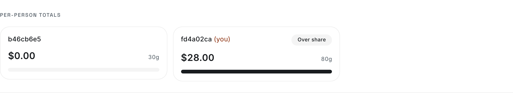
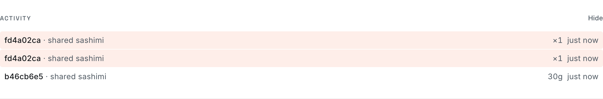
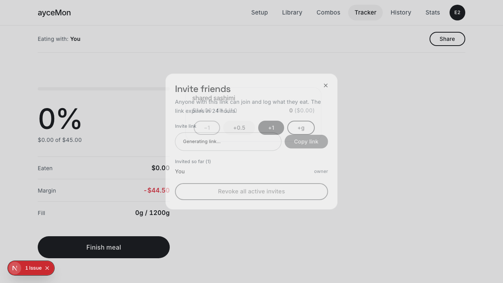
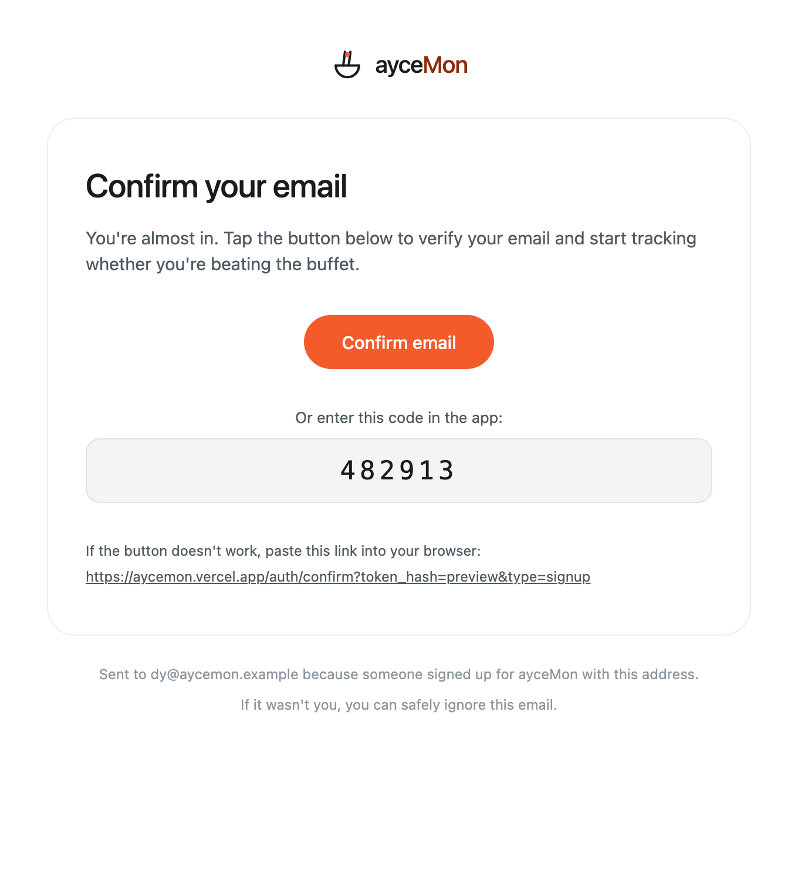
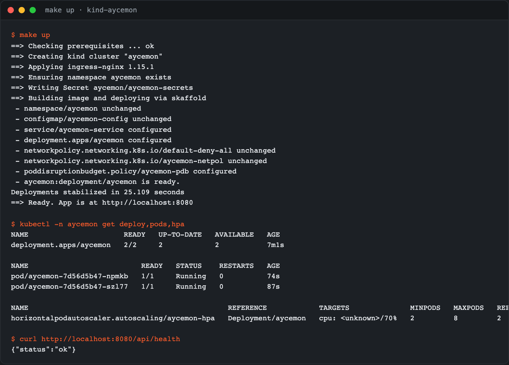
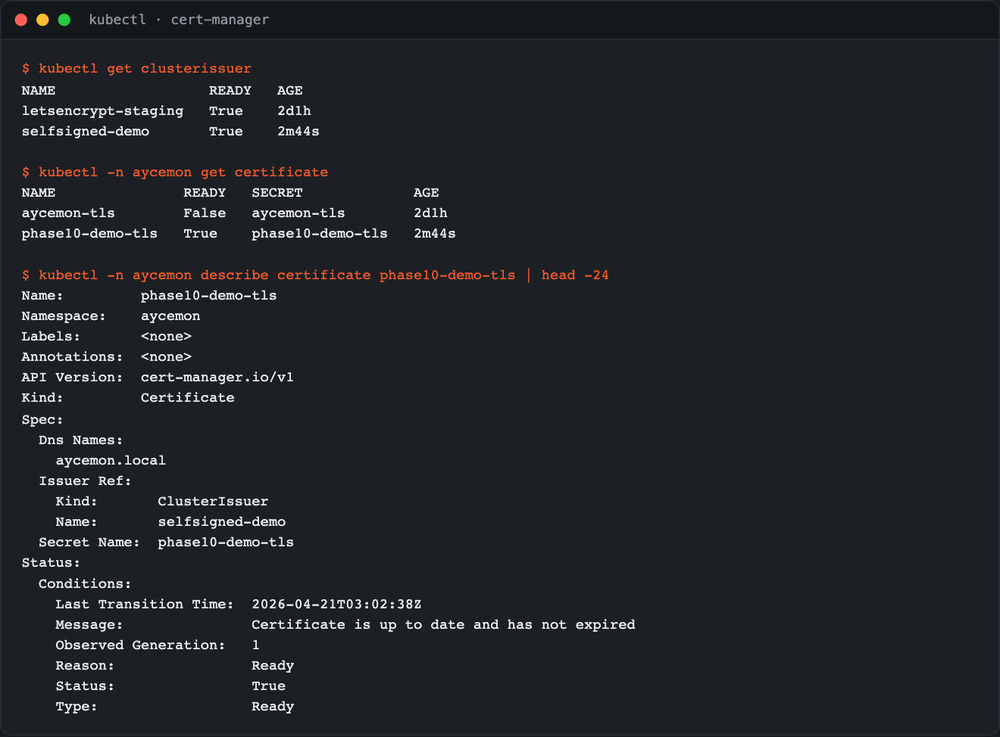

# ayceMon

Track whether you're beating the buffet. Start a session, build a library of items with their à la carte prices, eat strategically, and see if you got your money's worth.

The visual system — monochrome data surfaces, a single persimmon accent for brand moments, motion and spacing rules — is canonicalized in [`DESIGN.md`](DESIGN.md). New UI should consult it before touching tokens.

## Features

### Collaborative tracking

Signed-in users can turn any session into a **shared session**: the owner mints a short-lived invite link from the Share drawer, collaborators open the link, authenticate, and log their *own* eaten entries against the same session. Owners finalize when everyone's done — the result page on `/history/[id]` shows per-user attribution.

While a shared session is live, `/tracker` surfaces:

- **Per-person cost breakdown** — each collaborator's `$ eaten` and grams, with a fair-share progress bar against `buffetPrice / headcount`. Derived client-side from the 2.5s poll, not stored.

  

- **Activity feed** — reverse-chronological log of the last 20 entries across the table, with the current user's rows subtly tinted.

  

- **Join notifications** — a toast fires when a collaborator lands on the session, seeded against the mount-time roster so reloads don't spam.

Owner's view of the share drawer:



Invite tokens are 22-char base64url, single-use, and expire in 24 hours.

### Grams-based appetite model

The appetite budget is expressed in **grams of food** (research-backed defaults at 800 / 1200 / 1800 / 2500 g) — see [`docs/quantitative-appetite.md`](docs/quantitative-appetite.md) for provenance.

## Prerequisites

- Node.js 20+
- npm 10+
- A [Supabase](https://supabase.com) project (free tier works)
- A [Google Places API (New)](https://developers.google.com/maps/documentation/places/web-service/overview) key (optional — the app works without it, but restaurant autocomplete will be disabled)

## Environment Variables

Copy `.env.local.example` (or create `.env.local`) with these keys:

```
NEXT_PUBLIC_SUPABASE_URL=https://<your-project>.supabase.co
NEXT_PUBLIC_SUPABASE_ANON_KEY=<anon-key>
SUPABASE_SERVICE_ROLE_KEY=<service-role-key>
GOOGLE_PLACES_API_KEY=<your-places-api-key>
```

- `NEXT_PUBLIC_SUPABASE_URL` and `NEXT_PUBLIC_SUPABASE_ANON_KEY` are safe for the client bundle.
- `SUPABASE_SERVICE_ROLE_KEY` and `GOOGLE_PLACES_API_KEY` are **server-only** — they are never shipped to the browser. Modules that use them import `"server-only"` to enforce this at build time.

## Supabase Setup

1. Install the Supabase CLI as a dev dependency (already in `package.json`):
   ```bash
   npm install
   ```
2. Link your local project to a remote Supabase project:
   ```bash
   npx supabase link --project-ref <your-project-ref>
   ```
3. Apply migrations:
   ```bash
   npx supabase db push
   ```
4. Generate TypeScript types (optional — already committed):
   ```bash
   npx supabase gen types typescript --linked > lib/supabase/database.types.ts
   ```

## Branded auth emails

Auth email templates live in [`supabase/email-templates/`](supabase/email-templates/)
and are wired for local dev via `supabase/config.toml`. The hosted project's
Dashboard templates must be mirrored manually after any template change — see
[`docs/auth-email.md`](docs/auth-email.md) for the mirror runbook.



## Google Places API Key

1. Create a Google Cloud project and enable the **Places API (New)**.
2. Create an API key restricted to the Places API (New) and server IPs only.
3. **Set a billing quota cap** (recommended: $25/day for dev) before adding the key to `.env.local`.
4. Paste the key as `GOOGLE_PLACES_API_KEY` in `.env.local`.

Without a valid key, the restaurant combobox falls back to a free-text input. Sessions started without a resolved place cannot be saved to the database for signed-in users.

## Development

```bash
npm run dev
```

Open [http://localhost:3000](http://localhost:3000).

## Linting & Tests

```bash
npm run lint          # ESLint (no-explicit-any: error)
npm test              # Vitest unit tests
```

## E2E Tests (Playwright)

E2E specs live in `e2e/`:

- **`guest-path.spec.ts`** — guest flow (setup → library → combos → tracker → result); no auth required.
- **`signed-in-path.spec.ts`** — signed-in solo flow (sign in → setup → library → tracker → finish → history → stats).
- **`shared-session-invite.spec.ts`** — two-user invite / join / per-user attribution flow (Phase 7).
- **`grams-log.spec.ts`** — solo `+g` log path + result breakdown grams column (Phase 3).
- **`result-gate.spec.ts`** — `/result` redirect guard for in-progress sessions (Phase 4).

Specs that touch Supabase seed test users via the admin API and clean up after themselves. Run the full suite with:

```bash
npx playwright install chromium   # first time only
node --env-file=.env.local node_modules/@playwright/test/cli.js test
```

The `--env-file` flag loads `.env.local` so the specs see `NEXT_PUBLIC_SUPABASE_URL`, `NEXT_PUBLIC_SUPABASE_ANON_KEY`, and `SUPABASE_SERVICE_ROLE_KEY` — Playwright itself doesn't load that file, even though Next.js does. The Playwright config starts a dev server automatically (`npm run dev`).

To regenerate `docs/screenshots/share-drawer.png`:

```bash
SNAPSHOT_SHARE_DRAWER=1 node --env-file=.env.local node_modules/@playwright/test/cli.js test e2e/shared-session-invite.spec.ts
```

## Build

```bash
npm run build
npm start
```

## Docker

The app uses a multi-stage Docker build with Next.js standalone output. Public env vars are baked in at build time; secrets are injected at runtime.

**Build the image:**

```bash
docker build \
  --build-arg NEXT_PUBLIC_SUPABASE_URL=https://<your-project>.supabase.co \
  --build-arg NEXT_PUBLIC_SUPABASE_ANON_KEY=<anon-key> \
  -t aycemon .
```

**Run it:**

```bash
docker run -p 3000:3000 \
  -e SUPABASE_SERVICE_ROLE_KEY=<service-role-key> \
  -e GOOGLE_PLACES_API_KEY=<places-api-key> \
  aycemon
```

**Or use Docker Compose** (reads from `.env.local`):

```bash
docker compose up --build
```

## Quick start with Kubernetes

Local cluster via kind + Skaffold + ingress-nginx. One command bootstraps everything:

```bash
make doctor   # verify docker + kind + skaffold + .env.local
make up       # create cluster, install ingress-nginx, build image, deploy app on :8080
```

The app is then at [http://localhost:8080](http://localhost:8080). Live rebuild on file changes: `make dev`. Tail pod logs: `make logs`. Tear down: `make down`.



Toolchain versions are pinned in the `Makefile` (`KIND_VERSION`, `SKAFFOLD_VERSION`, `INGRESS_NGINX_VERSION`) so `make doctor` fails loudly when a laptop drifts.

**Production deploy.** Raw manifests live in `k8s/`. Apply directly with `kubectl apply -f k8s/` after editing `k8s/secret.yaml` with real base64-encoded secrets. The namespace enforces `pod-security.kubernetes.io/enforce: restricted`, so the pod `securityContext` pins `seccompProfile: RuntimeDefault` while the container `securityContext` drops all capabilities. TLS is wired through cert-manager (`k8s/cert-manager/cluster-issuer.yaml`). The metrics scrape surface is covered in [`k8s/README.md`](k8s/README.md); the secret-rotation runbook lives at [`docs/k8s-runbook.md`](docs/k8s-runbook.md).



## Live production

The app is dual-hosted: Vercel serves `https://aycemon.vercel.app` (canonical user-facing origin), and a GKE Autopilot cluster serves a K8s-native mirror.

- **Kubernetes URL:** https://aycemon.34-105-65-50.nip.io (Let's Encrypt prod cert, valid through 2026-07-20)
- **Cluster:** GKE Autopilot `aycemon-prod` in `us-west1`, ~$27–32/mo post-trial
- **Image registry:** `ghcr.io/dy0810/aycemon:sha-<commit>` (public GHCR package)
- **Provisioning runbook:** [`docs/k8s-runbook.md`](docs/k8s-runbook.md) — reproduces the cluster from scratch including the Autopilot-specific gotchas (cert-manager Helm install, ingress-nginx snippet-risk flags, ACME solver NetworkPolicy)

## CI/CD

A GitHub Actions workflow (`.github/workflows/docker-build.yml`) builds the Docker image on every PR and automatically deploys merges to main onto the GKE cluster.

- **`build` job** — runs on every PR and push. Builds with docker, tags `sha-<short>` + `latest` (on main), pushes to GHCR.
- **`deploy` job** — runs only on `push` to main. Authenticates against GCP via the `github-deployer` service account, fetches GKE credentials, rolls the deployment to the freshly-pushed SHA tag.

**Required GitHub Variables** (not Secrets — these are public / non-sensitive):

- `NEXT_PUBLIC_SUPABASE_URL` — baked into the Docker image at build time
- `NEXT_PUBLIC_SUPABASE_ANON_KEY` — baked into the Docker image at build time
- `GCP_PROJECT_ID` — target GCP project for the deploy job (`aycemon-494018`)
- `GKE_CLUSTER_NAME` — target cluster (`aycemon-prod`)
- `GKE_CLUSTER_REGION` — target region (`us-west1`)

**Required GitHub Secrets:**

- `GCP_SA_KEY` — JSON key for the `github-deployer` service account. SA has minimum-viable grants: `roles/container.clusterViewer` + `roles/container.developer`. Rotate via `gcloud iam service-accounts keys create /dev/stdout --iam-account=github-deployer@aycemon-494018.iam.gserviceaccount.com | gh secret set GCP_SA_KEY`.
